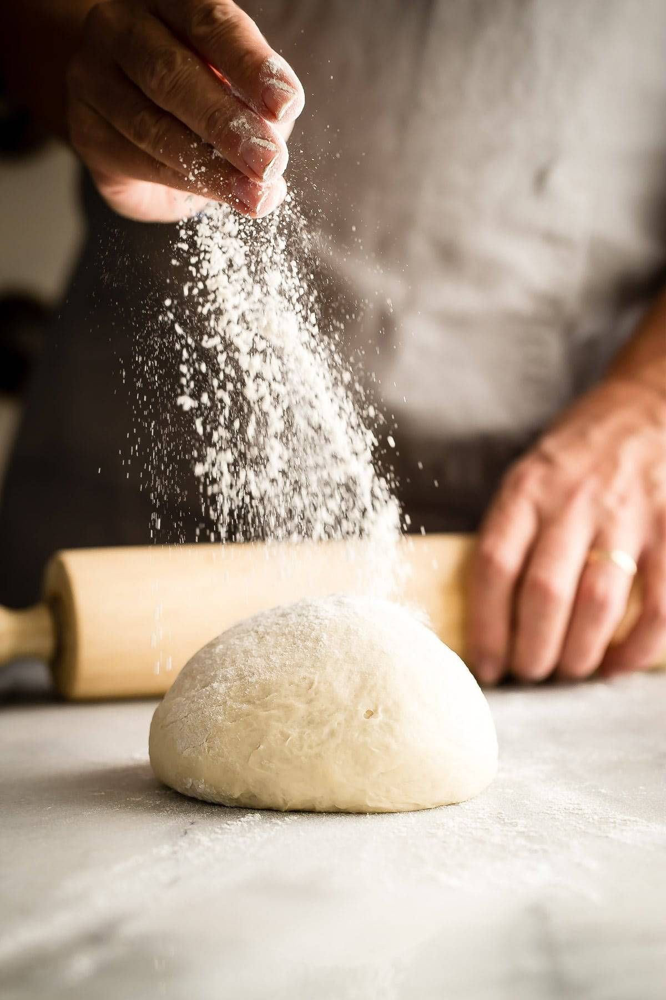
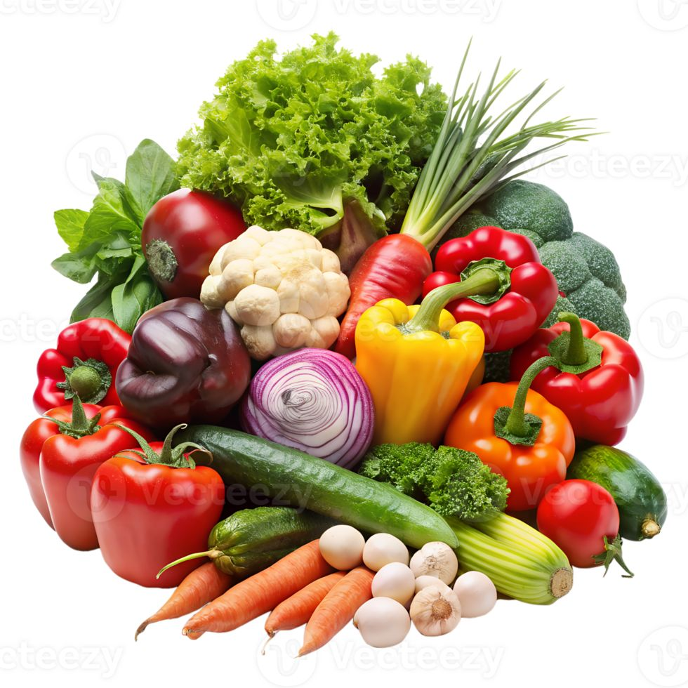
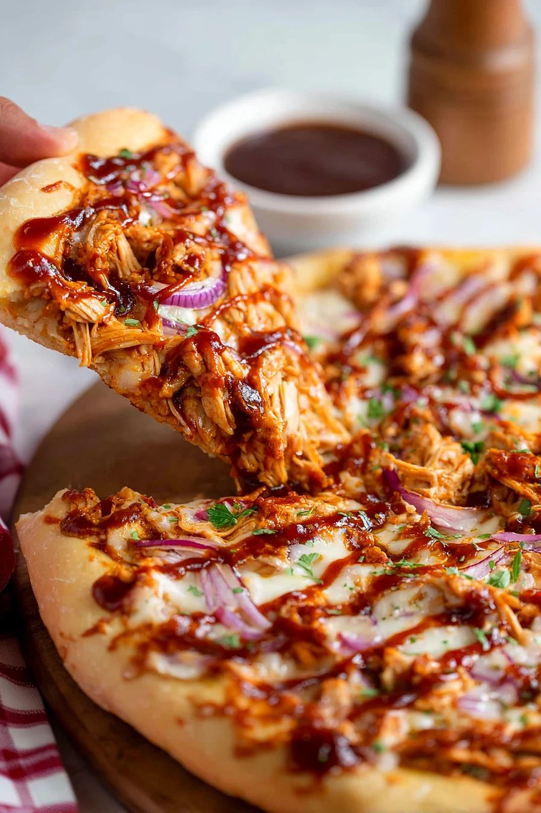
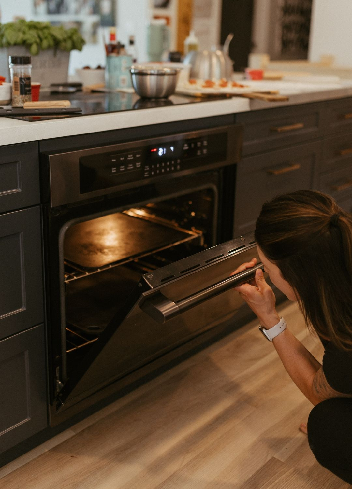

# Standard Operating Procedure (SOP): Homemade Pizza Preparation

---

**Document Title:** Standard Operating Procedure for Homemade Pizza Preparation  
**Version:** 1.0  
**Date:** April 1, 2026  
**Prepared By:** Group 5  
**Reviewed By:** Felix  

---

## 1. Purpose

This Standard Operating Procedure (SOP) establishes a consistent and repeatable method for preparing homemade pizza in a home kitchen setting. It ensures food quality, safety compliance, and efficient workflow management while producing two distinct pizza varieties: vegetarian and BBQ chicken.

---

## 2. Scope and Objectives

### Scope
This SOP applies to individuals preparing pizza using standard kitchen equipment in a residential environment.

### Objectives
- Prepare fresh pizza dough  
- Assemble two pizza varieties  
- Maintain food safety  
- Complete within 90 minutes  
- Serve at proper temperature  

---

## 3. Document Approval

| Role     | Name    | Date       |
|----------|--------|------------|
| Author   | Group 5 | 04/01/2026 |
| Reviewer | Felix   | 04/01/2026 |

---

## 4. Revision History

| Version | Date           | Description              |
|--------|----------------|--------------------------|
| 1.0    | April 1, 2026  | Initial document release |
| 0.9    | March 29, 2026 | Draft review comments    |
| 0.5    | March 27, 2026 | Initial draft creation   |

---

## 5. Accountability Matrix (RACI)

| Process Step            | Head Cook | Prep Cook | Household Members |
|------------------------|----------|-----------|-------------------|
| Gather Ingredients     | A        | R         | C                 |
| Prepare Dough          | A        | R         | -                 |
| Preheat Oven           | A        | R         | -                 |
| Shape Dough            | A        | R         | -                 |
| Add Sauce & Toppings   | A        | R         | C                 |
| Bake Pizza             | A        | R         | I                 |
| Cool and Slice Pizza   | A        | R         | I                 |
| Clean Workspace        | A        | R         | I                 |

---

<em>Figure 1: Process Flow</em>

## 6. Materials and Ingredients (For 4 People)

### Dough Ingredients

| Ingredient         | Quantity |
|-------------------|----------|
| All-purpose flour | 3 cups   |
| Warm water        | 1 cup    |
| Active dry yeast  | 2¼ tsp   |
| Sugar             | 2 tsp    |
| Salt              | 1 tsp    |
| Olive oil         | 2 tbsp   |

<em>Figure 1: Dough (Source: (Foodness Gracious, n.d.))</em>

---

### Veggie Pizza Toppings

| Ingredient        | Quantity |
|------------------|----------|
| Onion            | 1 medium |
| Green pepper     | 1 medium |
| Tomato           | 1 medium |
| Mushrooms        | 1 cup    |
| Black olives     | ½ cup    |
| Mozzarella       | 2 cups   |

<em>Figure 1: Veggie Toppings (Source: (Vecteezy, n.d.))</em>

---

### BBQ Chicken Ingredients

| Ingredient              | Quantity |
|------------------------|----------|
| Cooked chicken         | 1.5 cups |
| BBQ sauce              | ½ cup    |
| Red onion              | 1 medium |
| Green pepper           | 1 medium |
| Cheddar cheese         | 2 cups   |

<em>Figure 1: BBQ Toppings (Source: (Diethood, n.d.))</em>

---

## 7. Procedure

### 7.1 Dough Preparation

1. Activate yeast  
2. Mix dry ingredients  
3. Knead dough  
4. Let dough rise  

<em>Figure 1: Dough Kneading (Source: (WebstaurantStore, n.d.))</em>

---

### 7.2 Sauce Preparation

- Mix tomatoes, garlic, herbs  
- Rest sauce for flavor

<em>Figure 1: Sauce Preparation (Source: (Mangia with Nonna, n.d.))</em>

---

### 7.3 Veggie Pizza Assembly

1. Roll dough  
2. Add sauce  
3. Add cheese  
4. Add vegetables  
5. Final cheese layer  

<em>Figure 1: Veggie Pizza Assembly (Source: (Pizza Twist, n.d.))</em>

---

### 7.4 BBQ Chicken Pizza Assembly

1. Roll dough  
2. Add BBQ sauce  
3. Add cheese  
4. Add chicken & toppings  
5. Final drizzle  

<em>Figure 1: BBQ Pizza Assembly (Source: (Molly’s Home Guide, n.d.))</em>

---

## 8. Baking and Serving

- Bake at **450°F (230°C)**  
- 10–15 minutes  
- Golden crust and bubbling cheese  

<em>Figure 1: Baking (Source: (Atlas Steel Co., n.d.))</em>

---

## 9. Serving and Final Checks

1. Cool 2–3 minutes  
2. Slice into 8 pieces  
3. Serve immediately  

---

## 10. Quality and Safety

- Wash hands  
- Cook chicken to 165°F  
- Avoid cross-contamination  
- Clean workspace  

---

## 11. Conclusion

This SOP ensures consistent, safe, and high-quality pizza preparation in a home kitchen environment, producing two pizzas suitable for four people.

---

## 12. References (APA)

- Sausage and egg breakfast pizza. Foodness Gracious. (n.d.). https://foodnessgracious.com/recipes/sausage-and-egg-breakfast-pizza?utm_source=Pinterest&utm_medium=organic
- Vecteezy. (n.d.). Fresh organic vegetables including bell peppers, carrots, lettuce, broccoli, cauliflower, and onions isolated on a white background [PNG image]. Retrieved April 3, 2026, from https://www.vecteezy.com/png/47830754-fresh-organic-vegetables-including-bell-peppers-carrots-lettuce-broccoli-cauliflower-and-onions-isolated-on-a-white-background
- Diethood. (n.d.). Grilled BBQ chicken pizza. Retrieved April 3, 2026, from https://diethood.com/grilled-bbq-chicken-pizza
- WebstaurantStore. (n.d.). Baking terms glossary. Retrieved April 3, 2026, from https://www.webstaurantstore.com/article/1081/baking-terms-glossary.html
- Mangia with Nonna. (n.d.). Authentic Italian pizza sauce. Retrieved April 3, 2026, from https://mangiawithnonna.com/authentic-italian-pizza-sauce/
- Pizza Twist. (n.d.). Best pizza in Flower Mound, TX. Retrieved April 3, 2026, from https://pizzatwist.com/locations/best-pizza-in-flower-mound-tx
- Molly’s Home Guide. (n.d.). Easy BBQ chicken pizza. Retrieved April 3, 2026, from https://mollyshomeguide.com/easy-bbq-chicken-pizza-142225/
- Atlas Steel Co. (n.d.). Atlas Steel Co. Retrieved April 3, 2026, from https://atlassteelco.ca/
